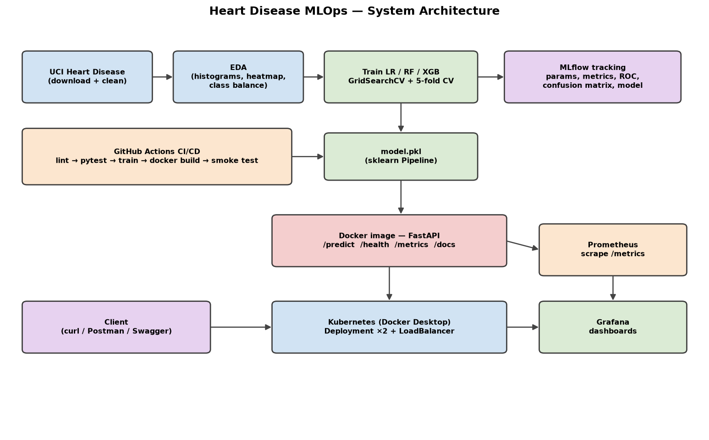

# Heart Disease Risk Prediction — MLOps Project Report

**Course:** Machine Learning Operations (MLOps) — AIMLCZG523
**Assignment:** 01 — End-to-End ML Model Development, CI/CD, and Production Deployment
**Dataset:** Heart Disease UCI (Cleveland), UCI Machine Learning Repository

> Replace this line with your name / BITS ID and the **GitHub repository link** before submission. Screenshot placeholders are marked with 📷 — capture them from your own runs (MLflow UI, GitHub Actions, Docker, `kubectl`, Grafana) as the academic-integrity note requires original artefacts.

---

## 1. Project Overview

The goal is to build a machine-learning classifier that predicts the risk of heart disease from patient clinical data and to deploy it as a **cloud-ready, monitored API**, following modern MLOps practice end to end.

The solution spans the full lifecycle:

1. **Data acquisition & EDA** — reproducible download from UCI + professional visualisations.
2. **Feature engineering & modelling** — a leak-free scikit-learn `Pipeline`, three tuned classifiers, cross-validated.
3. **Experiment tracking** — every run logged to MLflow (params, metrics, plots, model).
4. **Packaging & reproducibility** — one serialised `Pipeline` artifact + pinned dependencies.
5. **CI/CD** — GitHub Actions: lint → test → train → Docker build → container smoke test.
6. **Containerisation** — multi-stage Docker image serving FastAPI.
7. **Deployment** — Kubernetes (Docker Desktop) with a LoadBalancer service (+ Helm chart).
8. **Monitoring** — request logging, Prometheus metrics, Grafana dashboards.

**Headline result:** the tuned **Logistic Regression** pipeline achieves **ROC-AUC 0.968**, **accuracy 0.90**, and **recall 0.93** on the held-out test set — recall being the priority metric for a screening tool where missing a true case is costly.

---

## 2. Setup & Installation

Requires **Python 3.11–3.14**. Dependencies are pinned and install from pre-built wheels (verified on Python 3.14 / Windows and Python 3.12 / Linux CI).

```bash
git clone <your-repo-url> && cd heart-disease-mlops
python -m venv .venv
source .venv/Scripts/activate        # Windows Git Bash; use .venv\Scripts\Activate.ps1 in PowerShell
pip install --upgrade pip
pip install -r requirements-dev.txt

# Reproduce the full ML pipeline
python -m src.data.download          # 303 rows -> data/raw/
python -m src.data.preprocess        # -> data/processed/
python -m src.data.eda               # EDA figures -> reports/figures/
python -m src.models.train           # models/model.pkl + MLflow runs

# Serve the API
uvicorn src.api.main:app --port 8000 # http://localhost:8000/docs
```

The **runtime** container needs only `requirements.txt`; `requirements-dev.txt` adds EDA, testing, linting, and Jupyter.

---

## 3. Dataset & Exploratory Data Analysis

### 3.1 The data

The UCI Heart Disease (Cleveland) dataset has **303 patient records** with **13 clinical features** and a diagnosis field. The raw file is headerless and encodes missing values as `?`. The `download.py` script fetches it via the official `ucimlrepo` package (`id=45`), with a direct-URL fallback, and writes a properly headered CSV.

| Feature | Meaning | Type |
|---------|---------|------|
| age | Age (years) | numeric |
| sex | 1 = male, 0 = female | categorical |
| cp | Chest pain type (1–4) | categorical |
| trestbps | Resting blood pressure (mm Hg) | numeric |
| chol | Serum cholesterol (mg/dl) | numeric |
| fbs | Fasting blood sugar > 120 mg/dl | categorical |
| restecg | Resting ECG (0–2) | categorical |
| thalach | Max heart rate achieved | numeric |
| exang | Exercise-induced angina | categorical |
| oldpeak | ST depression on exercise | numeric |
| slope | Slope of peak ST segment | categorical |
| ca | Major vessels coloured (0–3) | categorical |
| thal | 3 = normal, 6 = fixed, 7 = reversible | categorical |
| num → **target** | Diagnosis; 0 = none, 1–4 = disease → **binarised to 0/1** | target |

### 3.2 Data quality & cleaning

- **Missing values:** only `ca` (4 rows) and `thal` (2 rows). Rather than dropping ~2% of a small dataset, these are **imputed inside the modelling pipeline** (median for numeric, most-frequent for categorical) so imputation is fit on training folds only.
- **Target binarisation:** the 0–4 severity field is collapsed to presence/absence (0 vs ≥1).
- **Duplicates:** exact duplicate rows removed.

### 3.3 EDA findings (figures in `reports/figures/`)

- **Class balance** (`eda_class_balance.png`): ~**46% positive** — close to balanced, so accuracy is meaningful alongside precision/recall/F1/ROC-AUC.
- **Distributions** (`eda_histograms.png`): `age` roughly normal (mean ≈ 54); `chol` and `trestbps` right-skewed with a few high outliers; `oldpeak` zero-inflated.
- **Correlation heatmap** (`eda_correlation_heatmap.png`): strongest correlates with the target are `cp`, `thalach` (negative), `oldpeak`, `ca`, and `exang` — all clinically sensible cardiac-risk indicators. No pair of features is collinear enough to warrant removal.
- **Feature relationships** (`eda_feature_relationships.png`): disease-positive patients show **lower max heart rate**, **higher ST depression (oldpeak)**, and **more affected vessels**.

📷 *Insert the four EDA figures here.*

---

## 4. Feature Engineering & Modelling

### 4.1 Preprocessing pipeline (reproducible, leak-free)

All feature engineering lives in a single scikit-learn `ColumnTransformer` (`src/features/pipeline.py`):

- **Numeric** (`age, trestbps, chol, thalach, oldpeak`): `SimpleImputer(median)` → `StandardScaler`.
- **Categorical** (`sex, cp, fbs, restecg, exang, slope, ca, thal`): `SimpleImputer(most_frequent)` → `OneHotEncoder(handle_unknown="ignore")`.

Because the transformer is bundled with the estimator into **one `Pipeline`**, it is fitted only on training data (inside cross-validation) and reused byte-for-byte at inference — eliminating train/serving skew. `handle_unknown="ignore"` makes the API robust to unseen categories.

### 4.2 Models, tuning, and validation

Three classifiers were trained, each as a full pipeline, tuned with **`GridSearchCV` (5-fold, ROC-AUC scoring)** on a stratified 80/20 split (`random_state=42`):

| Model | Tuned hyperparameters |
|-------|-----------------------|
| Logistic Regression | `C ∈ {0.01, 0.1, 1, 10}`, `solver ∈ {lbfgs, liblinear}` |
| Random Forest | `n_estimators ∈ {200,400}`, `max_depth ∈ {None,5,10}`, `min_samples_leaf ∈ {1,2,4}` |
| XGBoost | `n_estimators ∈ {200,400}`, `max_depth ∈ {3,5}`, `learning_rate ∈ {0.05,0.1}`, `subsample ∈ {0.8,1.0}` |

Each model reports both **5-fold CV ROC-AUC** (generalisation estimate) and **held-out test metrics**.

---

## 5. Model Comparison & Results

Held-out test set (n = 61) and 5-fold CV on the training set (n = 242):

| Model | Accuracy | Precision | Recall | F1 | Test ROC-AUC | CV ROC-AUC (mean ± std) |
|-------|:--------:|:---------:|:------:|:--:|:------------:|:-----------------------:|
| **Logistic Regression** ⭐ | **0.902** | 0.867 | **0.929** | **0.897** | **0.968** | 0.898 ± 0.047 |
| Random Forest | 0.885 | 0.839 | 0.929 | 0.881 | 0.952 | 0.897 ± 0.043 |
| XGBoost | 0.869 | 0.813 | 0.929 | 0.867 | 0.947 | 0.879 ± 0.025 |

**Selection rationale.** Logistic Regression is chosen as the production model. On this small, largely linearly-separable clinical dataset it **beats the tree ensembles on every headline metric**, is far cheaper to serve, and is **interpretable** (coefficients map to clinical risk factors) — a real advantage in a healthcare context. Best params: `C=0.1`, `solver=liblinear`. All three models achieve identical **0.929 recall**, which is the metric we most care about for a screening tool (few false negatives).

📷 *Insert `roc_logistic_regression.png` and `cm_logistic_regression.png` from `reports/figures/`.*

---

## 6. Experiment Tracking (MLflow)

Training logs everything to MLflow using a **SQLite backend** (`sqlite:///mlflow.db`; the file store is deprecated in MLflow 3.x). One parent run (`model-selection-*`) contains a **nested run per model**, each logging:

- **Parameters** — the best hyperparameters from grid search.
- **Metrics** — accuracy, precision, recall, F1, test ROC-AUC, and CV ROC-AUC mean/std.
- **Artifacts** — ROC curve and confusion-matrix PNGs.
- **Model** — the fitted sklearn Pipeline (cloudpickle flavour).

Browse the UI:

```bash
mlflow ui --backend-store-uri sqlite:///mlflow.db --port 5000   # http://localhost:5000
```

📷 *Insert MLflow screenshots: the runs table (compare the 3 models) and one run's metrics/artifacts.*

---

## 7. Model Packaging & Reproducibility

- The winning pipeline is serialised to **`models/model.pkl`** with `joblib`, alongside **`models/model_metadata.json`** (model name, best params, metrics, feature order, timestamp).
- Because preprocessing is *inside* the pipeline, the artifact is fully self-contained — the API just calls `predict_proba` on a raw feature row.
- **`requirements.txt`** pins exact, wheel-available versions; `random_state=42` fixes every stochastic step. A clean environment reproduces the same model and metrics.

---

## 8. CI/CD Pipeline (GitHub Actions)

`.github/workflows/ci.yml` runs on every push / PR with three dependent jobs:

1. **Lint & Test** — `flake8` (hard-fails on E9/F-class errors), `black`/`isort` format check, then **`pytest` with coverage** (uploaded as an artifact). *The pipeline fails the run if linting or any test fails.*
2. **Train Model** — downloads data, trains, and uploads `model.pkl` + metadata + plots as a build artifact.
3. **Docker Build Validation** — builds the image, runs the container, and **smoke-tests `/health`** to prove the image serves correctly.

📷 *Insert a screenshot of a green Actions run showing all three jobs, and one of the uploaded artifacts.*

The 17 unit/integration tests cover: target binarisation, missing-value handling, de-duplication, column contract, preprocessor NaN-removal, pipeline output shape/range, metric computation, and the API (`/health`, `/predict` happy path, 422 validation errors, 503 when no model, `/metrics` exposure).

---

## 9. Containerisation (Docker)

A **multi-stage** `Dockerfile` (Python 3.12-slim): stage 1 builds wheels, stage 2 installs them offline and copies `src/` + `models/`. It runs as a **non-root user**, exposes port 8000, and defines a container `HEALTHCHECK` against `/health`.

```bash
docker build -t heart-disease-api:latest .
docker run --rm -p 8000:8000 heart-disease-api:latest
curl -X POST http://localhost:8000/predict -H "Content-Type: application/json" -d @sample_request.json
```

The `/predict` endpoint accepts JSON, validates it with Pydantic, and returns:

```json
{"prediction": 1, "label": "Heart disease", "confidence": 0.9635, "probability_disease": 0.9635, "model_name": "logistic_regression"}
```

📷 *Insert `docker build` success, `docker run`, and a successful `/predict` response (Swagger or curl).*

---

## 10. Production Deployment (Kubernetes)

Deployed to **Docker Desktop Kubernetes**. Manifests in `k8s/`:

- **`deployment.yaml`** — 2 replicas, CPU/memory requests+limits, **readiness & liveness probes** on `/health`, and Prometheus scrape annotations.
- **`service.yaml`** — a **LoadBalancer** service publishing port 8000 (reachable at `http://localhost:8000` on Docker Desktop).

```bash
docker build -t heart-disease-api:latest .
kubectl apply -f k8s/
kubectl get pods,svc
```

A **Helm chart** (`helm/heart-disease-api/`) provides the same deployment parameterised via `values.yaml` (`helm install heart ./helm/heart-disease-api`).

📷 *Insert `kubectl get pods,svc` (pods Running), and a `/predict` call through the service.*

---

## 11. Monitoring & Logging

- **Logging:** a FastAPI middleware logs every request (method, path, status, latency) to stdout — visible via `docker logs` / `kubectl logs`.
- **Metrics:** `prometheus-fastapi-instrumentator` exposes standard HTTP latency/throughput at `/metrics`, plus a **custom `heart_predictions_total{outcome=...}` counter** to watch the positive/negative prediction mix (a simple drift signal).
- **Stack:** `docker compose up` brings up API + **Prometheus** (scrapes every 10s) + **Grafana** (datasource + dashboard auto-provisioned) with panels for request rate, p95 latency, status codes, and prediction outcomes.

Why it matters for ML systems: monitoring surfaces **model failures, data/prediction drift, API downtime, and performance degradation** before they affect users.

📷 *Insert Prometheus targets (UP) and the Grafana dashboard with live traffic.*

---

## 12. System Architecture



Development produces a tracked, versioned model artifact; CI/CD validates and packages it into a Docker image; Kubernetes serves it behind a LoadBalancer; Prometheus and Grafana observe it in production.

---

## 13. Repository & Deliverables

- **GitHub repository:** `<insert link>`
- **Code, Dockerfile, requirements** — root of the repo.
- **Dataset + download script** — `src/data/download.py`, `data/`.
- **Notebooks/scripts** — `notebooks/01_eda.ipynb`, `src/`.
- **Tests** — `tests/`.
- **CI/CD** — `.github/workflows/ci.yml`.
- **Deployment manifests / Helm** — `k8s/`, `helm/`.
- **Screenshots** — `reports/screenshots/`.
- **Video** — `<insert link to short pipeline walkthrough>`.

---

## 14. Conclusion

This project delivers a reproducible, tested, containerised, and monitored heart-disease classifier that meets every assignment requirement. The tuned Logistic Regression (ROC-AUC 0.968, recall 0.93) is both accurate and interpretable — the right choice for a clinical screening context — and the surrounding MLOps scaffolding (MLflow, CI/CD, Docker, Kubernetes, Prometheus/Grafana) makes it safe to iterate on and operate in production.

**Possible extensions:** data-drift detection with Evidently, a model registry with staged promotion, automated retraining triggers, and canary deployments.
